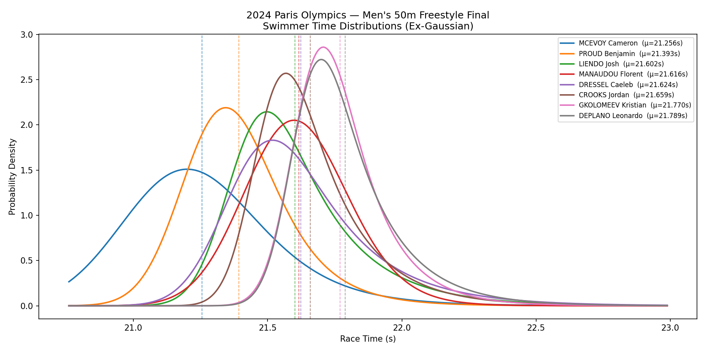
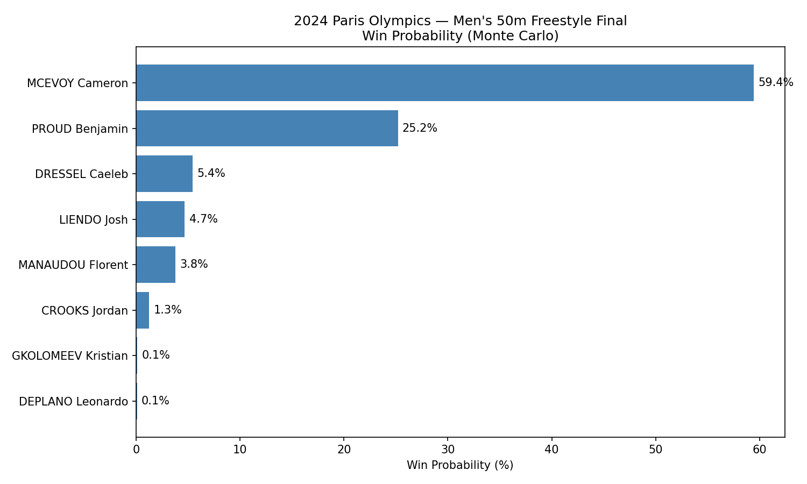

# swim-monte-carlo

A Monte Carlo simulation that models finishing-position probabilities for competitive swimming finals using historical LCM (long course metre) results.

All 28 individual swimming events from the **2024 Paris Olympics** are supported. Hyperparameters are tuned via Bayesian optimization (Optuna) against actual Paris 2024 results, and benchmarked against a crowdsourced pick-em baseline of 1,037 respondents.

---

## Repository Structure

```
run.py                  # Main entry point — run the simulation
tune_hyperparams.py     # Bayesian hyperparameter tuning (Optuna)
validate.py             # Quick Brier score check against Paris 2024 results
audit_times.py          # Inspect raw athlete times for short-course contamination
fetch_actual_results.py # Fetch actual Paris 2024 results
run_headless.py         # Headless simulation (saves charts, no GUI)
src/
  config.py             # All tunable hyperparameters
  events.py             # Event catalogue with world records
  fetcher.py            # Swimming results data client (local only, not committed)
  models.py             # Data classes (Athlete, RaceModel, SimResult)
  simulation.py         # Model fitting and Monte Carlo simulation
  output.py             # Printing, charting, CSV/JSON export
# Local-only (not committed to git)
fetch_actual_results.py # Fetches actual Paris 2024 results from results data source
src/fetcher.py          # Data client with API endpoints

validation/
  actual_results.csv    # Paris 2024 top-4 finishers (ground truth)
  athlete_cache/        # Cached athlete histories (JSON, one file per event)
  optuna-main.db        # Optuna study database (SQLite, branch-specific)
```

---

## Setup

### 1. Create the conda environment

```bash
conda create -n swim-monte-carlo python=3.11
conda activate swim-monte-carlo
pip install -r requirements.txt
```

### 2. Run the simulation

```bash
# Default event (Men's 50m Freestyle)
python run.py

# Specify any 2024 Paris Olympics event
python run.py --event men_200_breast
python run.py --event women_100_fly
python run.py --event men_400_im

# Headless mode — saves charts to results/ without opening windows
python run_headless.py --event men_200_breast
```

Available event slugs follow the pattern `{men|women}_{distance}_{stroke}`, e.g. `men_50_free`, `women_200_back`, `men_400_im`. Run `python run.py --help` to list all 28 options.

Results are written to `results/`:

| File | Contents |
|---|---|
| `probabilities.csv` | Finishing-position probabilities for each swimmer |
| `probabilities.json` | Same data in JSON format |
| `distributions.png` | Ex-Gaussian PDF chart per swimmer |
| `win_probabilities.png` | Win probability bar chart |

### 3. Run the tests

```bash
pytest tests/
```

---

## Hyperparameter Tuning

Hyperparameters in `src/config.py` are tuned via Bayesian optimization using [Optuna](https://optuna.org/), minimising Brier score against actual Paris 2024 top-4 results across all 28 events.

### Workflow

```bash
# Build (or refresh) the athlete history cache for all events
python tune_hyperparams.py --cache-only

# Score the current config.py values against actual results
python tune_hyperparams.py --score-current

# Run 200 Optuna trials (resumable — Ctrl+C and rerun to continue)
python tune_hyperparams.py --trials 200

# Run more trials on top of existing ones
python tune_hyperparams.py --trials 1000

# Print suggested config.py edits for the best parameters found
python tune_hyperparams.py --apply-best

# Quick validation without tuning
python validate.py
```

Optuna stores trials in `validation/optuna-{branch}.db` — each git branch gets its own database so trial history doesn't bleed across model variants.

### Tuned Parameters (Paris 2024)

| Parameter | Tuned Value |
|---|---|
| `SEASON_DECAY` | 0.5452 |
| `MAX_SEASONS` | 3 |
| `BEST_TIME_DECAY` | 1.2343 |
| `DECAY_DISTANCE_EXP` | 0.7961 |
| `DEFAULT_SIGMA` | 0.0713 |
| `DEFAULT_TAU` | 0.5985 |

| Model | Brier Score |
|---|---|
| Simulator (tuned) | **0.1626** |
| Crowd baseline (1,037 respondents) | 0.1885 |

The simulator beats the crowd pick-em by a margin of **0.026 Brier**.

---

## Auditing for Short-Course Contamination

Short-course (25m pool) times are typically 1.5–3% faster than LCM and will corrupt the model if included. Use `audit_times.py` to inspect raw times for any event and flag suspicious results.

```bash
# Show all swimmers' times with weights and suspicion flags
python audit_times.py --event men_100_back

# Filter to one swimmer
python audit_times.py --event men_100_back --swimmer CECCON

# Only show swimmers with at least one flagged time
python audit_times.py --event men_100_back --fast-only
```

If a competition looks suspicious, add a substring of its name to `EXCLUDED_COMPETITIONS` in `src/config.py`, delete the event's cache file (`validation/athlete_cache/{event}.json`), and rebuild with `python tune_hyperparams.py --cache-only`.

---

## Configuration (`src/config.py`)

| Parameter | Tuned Value | What it controls |
|---|---|---|
| `N_SIMULATIONS` | `10_000` | Number of races simulated. Higher = more stable probabilities, slower. |
| `DEFAULT_SIGMA` | `0.0713` | Fallback standard deviation (seconds per 50m) when a swimmer has only one recorded time. |
| `DEFAULT_TAU` | `0.5985` | Fallback exponential component (seconds per 50m) when fewer than 3 results are available. |
| `SEASON_DECAY` | `0.5452` | Weight retained per older season. `0.5` = each older season is half as influential. |
| `MAX_SEASONS` | `3` | Seasons of history used. |
| `BEST_TIME_DECAY` | `1.2343` | Steepness of proximity weighting toward the world record. `weight = exp(-effective_decay × (time − WR))`. |
| `DECAY_DISTANCE_EXP` | `0.7961` | Scales proximity decay by event distance: `effective_decay = BEST_TIME_DECAY / (distance / 50) ^ exp`. At `0.0` all events use the same decay; at `1.0` a 200m event gets half the decay of a 50m. |
| `EXCLUDED_COMPETITIONS` | (list) | Competitions excluded by name substring — used to filter short-course and non-standard meets. |
| `DEFAULT_EVENT` | `"men_50_free"` | Event run when no `--event` flag is passed. |

---

## The Model

### 1. Data collection & filtering

Historical LCM results are fetched for each finalist. Only times recorded **before the event date** are kept. Short-course and non-standard meets are excluded via `EXCLUDED_COMPETITIONS`.

### 2. Seasonal weighting

Each result is assigned a season weight of `SEASON_DECAY ^ seasons_ago`. The most recent season receives full weight (1.0); each older season is discounted. Results older than `MAX_SEASONS` seasons are dropped.

### 3. Proximity weighting

When estimating spread (σ), faster times receive more weight via `exp(-effective_decay × (time − WR))`, where `effective_decay = BEST_TIME_DECAY / (distance / 50) ^ DECAY_DISTANCE_EXP`. The distance scaling ensures proximity weighting is proportionally equivalent across sprint and distance events.

### 4. Season-drop (taper) adjustment

Swimmers peak at championship meets through tapering. For each season, the model computes a relative drop: `(season_avg − season_best) / season_avg`. These are averaged across seasons (weighted by recency) to estimate each swimmer's typical taper improvement.

The projected mean is computed from the **season-weighted average** (no proximity bias), then adjusted downward by the taper estimate:

```
mu_season = season-weighted average of times
mu = mu_season × (1 − season_drop)
```

This separates the taper signal from proximity weighting. A swimmer who consistently drops 2% at major meets projects meaningfully faster than one who swims to their season average.

### 5. Ex-Gaussian distribution

Each swimmer's race time is modelled as an **ex-Gaussian** random variable:

```
X = Normal(μ − τ, σ_n) + Exponential(τ)
```

- The **normal component** anchors peak performance near the projected mean.
- The **exponential component** (τ) generates the right-skewed tail for off-days.
- τ is estimated per swimmer from the weighted third central moment. Falls back to `DEFAULT_TAU` when fewer than 3 results are available.

**Further reading:**
- [Wikipedia: Exponentially modified Gaussian distribution](https://en.wikipedia.org/wiki/Exponentially_modified_Gaussian_distribution)
- Palmer et al. (2011). What are the shapes of response time distributions in visual search? *Journal of Experimental Psychology*, 37(1), 58–71. [DOI](https://doi.org/10.1037/a0020747)

---

## Validation — Paris 2024

The simulator was validated against all 28 individual Paris 2024 Olympic finals using Brier score (mean squared error between predicted top-4 probability and actual 0/1 outcome). Lower is better.

| Model | Brier Score |
|---|---|
| Simulator (tuned) | **0.1626** |
| Crowd pick-em (1,037 respondents) | 0.1885 |
| Improvement | +0.026 |

Hyperparameters were optimised over 1,000 Optuna trials. The search converged within the first 200 trials, suggesting the model is near its ceiling for this architecture and dataset size.
---

## Sample Output — Men's 50m Freestyle

*Run with *
'''bash
python run.py --event men_50_free
'''

### Finishing-position probabilities

| Swimmer | P(1) | P(2) | P(3) | P(4) | P(5) | P(6) | P(7) | P(8) |
|---|---|---|---|---|---|---|---|---|
| MCEVOY Cameron | 54.8% | 19.3% | 8.5% | 5.2% | 3.3% | 2.9% | 2.8% | 3.2% |
| PROUD Benjamin | 19.5% | 29.1% | 19.8% | 12.4% | 8.0% | 5.4% | 3.8% | 2.0% |
| DRESSEL Caeleb | 10.5% | 13.2% | 13.0% | 11.0% | 11.0% | 10.9% | 12.8% | 17.6% |
| LIENDO Josh | 8.4% | 14.4% | 14.7% | 13.4% | 12.9% | 11.7% | 11.4% | 13.1% |
| MANAUDOU Florent | 2.6% | 8.0% | 13.9% | 17.8% | 19.0% | 17.4% | 13.6% | 7.7% |
| CROOKS Jordan | 2.3% | 8.7% | 15.2% | 17.2% | 15.5% | 14.2% | 12.4% | 14.7% |
| DEPLANO Leonardo | 1.6% | 5.0% | 9.2% | 12.4% | 14.6% | 15.5% | 18.8% | 23.0% |
| GKOLOMEEV Kristian | 0.3% | 2.3% | 5.8% | 10.7% | 15.7% | 22.0% | 24.5% | 18.7% |

### Charts




