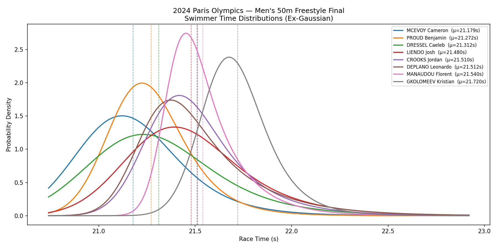
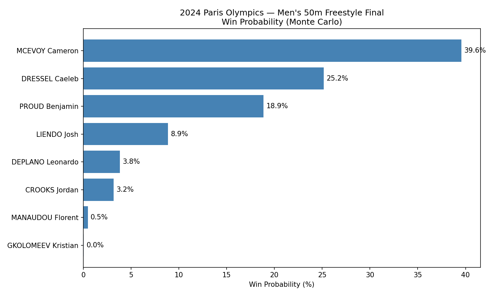

# swim-monte-carlo

A Monte Carlo simulation that models finishing-position probabilities for competitive swimming finals using historical LCM (long course metre) results.

The current event used is the **2024 Paris Olympics — Men's 50m Freestyle Final**.

---

## Setup

### 1. Create the conda environment

```bash
conda create -n swim-monte-carlo python=3.11
conda activate swim-monte-carlo
pip install -r requirements.txt
```

### 2. Run the simulation

```bash
# With matplotlib GUI charts
python main.py

# Headless (saves charts to results/ without opening windows)
python run_headless.py
```

Results are written to `results/`:
| File | Contents |
|---|---|
| `probabilities.csv` | Finishing-position probabilities for each swimmer |
| `probabilities.json` | Same data in JSON format |
| `distributions.png` | Ex-Gaussian PDF chart per swimmer |
| `win_probabilities.png` | Win probability bar chart |

### 3. Run the tests

```bash
pytest tests/
```

---

## Configuration (`config.py`)

| Parameter | Default | What it controls |
|---|---|---|
| `N_SIMULATIONS` | `1_000_000` | Number of races simulated. Higher = more stable probabilities, slower run. Lower = noisier but faster. |
| `DEFAULT_SIGMA` | `0.3` | Fallback standard deviation (seconds) used when a swimmer has only one recorded time and variance can't be estimated. Higher = wider spread of outcomes for data-sparse swimmers. |
| `DEFAULT_TAU` | `0.05` | Fallback exponential component (seconds) when fewer than 3 results are available to estimate right-skew. Higher = fatter right tail even for data-sparse swimmers. |
| `SEASON_DECAY` | `0.3` | Fraction of weight retained per older season. `0.3` means each season is 30% as influential as the next newer one. Lower = model cares almost entirely about the most recent season. Higher = older seasons count nearly as much as recent ones. |
| `SEASON_START_MONTH` | `9` | Month that starts a new swim season (September). Adjust if targeting a league with a different season calendar. |
| `MAX_SEASONS` | `4` | Maximum number of seasons of history used. `4` covers the Olympic cycle. Higher = more historical data but risks stale results. Lower = only recent seasons matter. |
| `BEST_TIME_DECAY` | `2.0` | Controls how strongly times near the world record are upweighted relative to slower times. `weight = exp(-BEST_TIME_DECAY × (time − WR))`. Higher = elite performances dominate the model almost completely. Lower = off-days drag the projected mean up more. |
| `WORLD_RECORD` | `20.91` | The LCM 50m freestyle world record at the time of the target event. Used as the anchor for proximity weighting. Update this when targeting a different event or discipline. |
| `EXCLUDED_COMPETITIONS` | `["World Cup", "25m", "Short Course", "NCAA Dual Meet", "ISL"]` | Any competition whose name contains one of these strings is excluded. World Cup and ISL events are short-course (25m pool) and not comparable to LCM. Add strings here to filter out other non-standard meets. |

---

## The Model

### 1. Data collection & filtering

Historical results are fetched from the World Aquatics API for each finalist. Only LCM (long course) 50m freestyle times recorded **before the event date** are kept. Short-course and exhibition meets are excluded via `EXCLUDED_COMPETITIONS`.

### 2. Seasonal weighting

Each result is assigned a season weight of `SEASON_DECAY ^ seasons_ago`. A swimmer's most recent season receives full weight (1.0); each older season is multiplied by `SEASON_DECAY` again. Results older than `MAX_SEASONS` seasons are dropped entirely.

### 3. Proximity weighting

Within a season, faster times receive more weight via `exp(-BEST_TIME_DECAY × (time − WORLD_RECORD))`. This prevents a single bad race from dragging down the projected mean, and reflects that elite-level performances are more predictive of championship results.

### 4. Season-drop adjustment

Swimmers often drop significant time at championship meets relative to their season average (tapering, peaking). For each season, the model computes a relative drop: `(season_avg − season_best) / season_avg`. These are averaged across seasons (weighted by recency) and applied multiplicatively to lower the projected mean: `μ = μ_raw × (1 − season_drop)`. A swimmer who consistently drops 3% at major meets will project ~0.6s faster than their weighted average.

### 5. Ex-Gaussian distribution

Each swimmer's race time is modelled as an **ex-Gaussian** (exponentially modified Gaussian) random variable rather than a simple normal distribution.

A normal distribution is symmetric — it assigns equal probability to going 0.2s faster or 0.2s slower than the mean. Swim times don't work that way. Most of the probability mass sits close to a swimmer's PB, the left tail (going faster than ever before) is thin, and the right tail (an off-day, a bad start, disqualification pressure) is longer. The ex-Gaussian captures this naturally:

```
X = Normal(μ − τ, σ_n)  +  Exponential(τ)
```

- The **normal component** anchors peak performance near the projected mean.
- The **exponential component** (τ) generates the right-skewed tail for off-days.
- The **expected value** of X is still μ (the two components cancel), so the projected mean is preserved.
- τ is estimated per swimmer from the weighted third central moment: `τ = (m₃ / 2)^(1/3)`. Swimmers with more variance in their results get a larger τ (fatter right tail). Falls back to `DEFAULT_TAU` when fewer than 3 results are available.

**Further reading:**
- Hohle, M. (1965). *An Exponentially Modified Gaussian (EMG) Distribution.* The foundational paper describing the distribution. [Wikipedia overview](https://en.wikipedia.org/wiki/Exponentially_modified_Gaussian_distribution)
- Luce, R.D. (1986). *Response Times: Their Role in Inferring Elementary Mental Organization.* Oxford University Press. Established the ex-Gaussian as the standard model for human performance time data.
- Palmer, E.M., Horowitz, T.S., Torralba, A., & Wolfe, J.M. (2011). What are the shapes of response time distributions in visual search? *Journal of Experimental Psychology: Human Perception and Performance*, 37(1), 58–71. [DOI](https://doi.org/10.1037/a0020747) — practical treatment of fitting and interpreting ex-Gaussian parameters.
- [scipy.stats.exponnorm](https://docs.scipy.org/doc/scipy/reference/generated/scipy.stats.exponnorm.html) — the implementation used here.

---

## Results — 2024 Paris Olympics Men's 50m Freestyle Final

*Based on 1,000,000 simulated races using LCM 50m freestyle results recorded before 2024-08-02.*

### Swimmer models

| Swimmer | PB | Proj. Mean (μ) | Std Dev (σ) | Tau (τ) | Season Drop |
|---|---|---|---|---|---|
| MCEVOY Cameron | 21.06s | 21.179s | 0.291s | 0.200s | 1.92% |
| PROUD Benjamin | 21.25s | 21.272s | 0.222s | 0.157s | 1.07% |
| MANAUDOU Florent | 21.54s | 21.540s | 0.195s | 0.176s | 1.40% |
| LIENDO Josh | 21.48s | 21.480s | 0.342s | 0.258s | 2.03% |
| GKOLOMEEV Kristian | 21.72s | 21.720s | 0.188s | 0.138s | 1.03% |
| DRESSEL Caeleb | 21.04s | 21.312s | 0.364s | 0.261s | 2.04% |
| DEPLANO Leonardo | 21.49s | 21.512s | 0.308s | 0.278s | 1.85% |
| CROOKS Jordan | 21.51s | 21.510s | 0.270s | 0.224s | 1.25% |

### Finishing-position probabilities

| Swimmer | P(1) | P(2) | P(3) | P(4) | P(5) | P(6) | P(7) | P(8) |
|---|---|---|---|---|---|---|---|---|
| MCEVOY Cameron | 39.6% | 22.0% | 13.3% | 8.6% | 6.0% | 4.4% | 3.4% | 2.7% |
| DRESSEL Caeleb | 25.1% | 18.4% | 13.7% | 10.6% | 8.8% | 7.8% | 7.3% | 8.2% |
| PROUD Benjamin | 18.8% | 25.8% | 21.1% | 13.7% | 8.9% | 5.8% | 3.7% | 2.2% |
| LIENDO Josh | 8.9% | 12.3% | 13.5% | 13.3% | 12.5% | 12.4% | 12.5% | 14.6% |
| DEPLANO Leonardo | 3.8% | 9.8% | 14.7% | 16.5% | 15.3% | 13.6% | 12.3% | 14.1% |
| CROOKS Jordan | 3.2% | 8.4% | 13.4% | 16.5% | 16.9% | 15.7% | 13.6% | 12.4% |
| MANAUDOU Florent | 0.5% | 3.0% | 9.0% | 17.1% | 22.5% | 21.7% | 16.1% | 10.1% |
| GKOLOMEEV Kristian | 0.0% | 0.3% | 1.3% | 3.8% | 9.1% | 18.6% | 31.1% | 35.7% |

### Sportsbook odds (American format)

| Swimmer | To Win | Top 3 |
|---|---|---|
| MCEVOY Cameron | +152 | -299 |
| DRESSEL Caeleb | +298 | -134 |
| PROUD Benjamin | +431 | -192 |
| LIENDO Josh | +1018 | +188 |
| DEPLANO Leonardo | +2524 | +254 |
| CROOKS Jordan | +3072 | +300 |
| MANAUDOU Florent | +20442 | +700 |
| GKOLOMEEV Kristian | +265152 | +6040 |

### Winning time O/U lines

Projected winning time: **20.989s** (median 21.002s)

| Line | Under | Over |
|---|---|---|
| 20.90s | +250 | -250 |
| 20.95s | +160 | -160 |
| 21.00s | +102 | -102 |
| 21.05s | -158 | +158 |
| 21.10s | -265 | +265 |

### Charts




